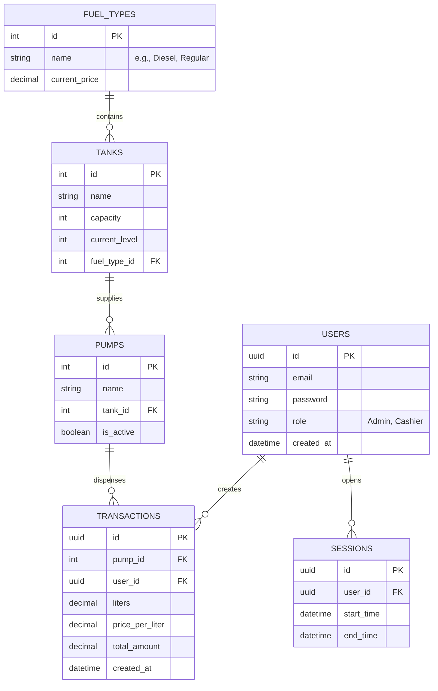

# Entity-Relationship Diagram

## Description
- **USERS**: Represents both Admins and Cashiers.
- **FUEL_TYPES**: Defines standard fuel types and current pricing.
- **TANKS**: Physical storage of fuel, tracking capacity and alerts.
- **PUMPS**: The point of sale linked to specific tanks.
- **TRANSACTIONS**: Each individual fuel sale, recording liters, price, and calculating total.
- **SESSIONS**: User shifts/login sessions for auditing.
